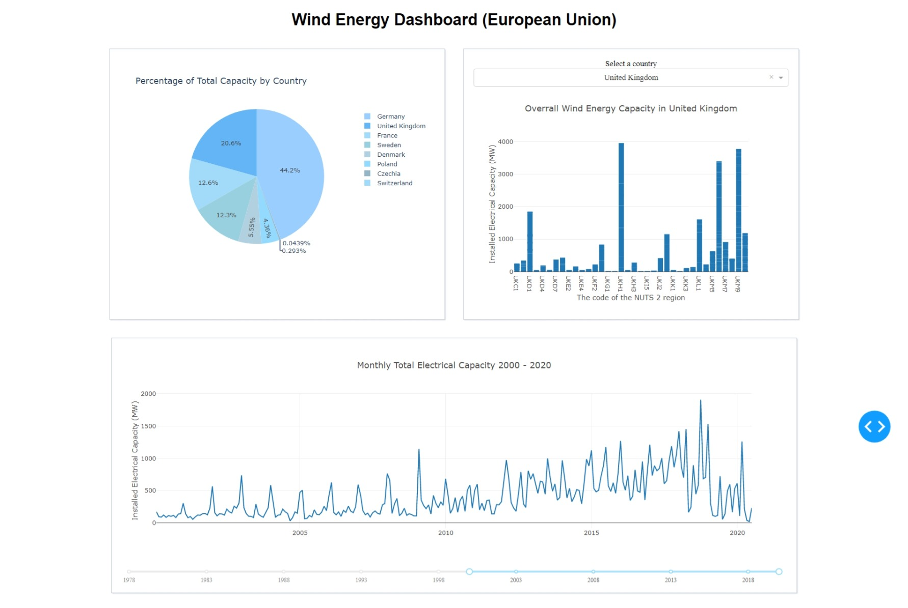

## Wind Energy Dashboard (European Union)

This project aims to create an interactive dashboard to visualize wind energy data in the European Union. The data is sourced from the [Open Power System Data](https://data.open-power-system-data.org/renewable_power_plants/2020-08-25).

This is a dashboard that displays wind energy data for the European Union. The dashboard consists of three charts:

1. A pie chart showing the percentage of total capacity by country
2. A bar chart showing the overall wind energy capacity in a selected country
3. A line chart showing the monthly total electrical capacity for the European Union

The pie chart and the bar chart have dropdown menus for country selection. The line chart has a slider for selecting a year range.

## Data Pipeline

### 1. Data Source:
https://data.open-power-system-data.org/renewable_power_plants/2020-08-25

### 2. Data Cleaning:
Clean and preprocess the data using Python libraries such as Pandas. Remove duplicates, handle missing values, and ensure data consistency.

### 3. Data Storage:
Store the cleaned data into a PostgreSQL database. Use SQL queries to optimize data storage and retrieval.

### 4.Data Analytics & Data Visualization
Generate insights in the data using Python libraries Plotly. Create interactive dashboards and visualizations using Dash.

### Technologies Used

The following technologies were used to build this dashboard:

- [Dash](https://plotly.com/dash/)  
  A Python framework for building analytical web applications.
- [Plotly](https://plotly.com/) 
  A data visualization library that allows creating interactive and publication-ready charts.
- [Pandas](https://pandas.pydata.org/)
  A fast, powerful, and easy-to-use open-source data analysis and manipulation tool.
- [SQLAlchemy](https://www.sqlalchemy.org/)
  A SQL toolkit and Object-Relational Mapping (ORM) library for Python.

## Getting Started

To get started with this project, follow these steps:

1. Clone this repository onto your local machine.
2. Download the dataset from [https://data.open-power-system-data.org/renewable_power_plants/2020-08-25](https://data.open-power-system-data.org/renewable_power_plants/2020-08-25).
3. Run the `pre_data_processing.ipynb` file to clean and preprocess the data. You can choose to store the cleaned data into a PostgreSQL database or a CSV file.
4. If you chose to store the cleaned data in a PostgreSQL database, you will need to set up a database
5. Run the `wind_energy_dashboard.py` file to start the dashboard.
6. Open your web browser and navigate to `http://localhost:8050` to view the dashboard.

Note: 
1. If you exported the cleaned data to a CSV file, you will need to modify the `wind_energy_dashboard.py` file to load the data from the CSV file instead of a PostgreSQL database.
2. Please note that this is not a final version and may be subject to further refinements. If you encounter any issues or have suggestions for future improvements, feel free to contact me zxyzhouxiangyi@gmail.com

## Reference
https://github.com/microsoft/ML-For-Beginners

https://github.com/microsoft/Data-Science-For-Beginners

## License
This project is licensed under the MIT License